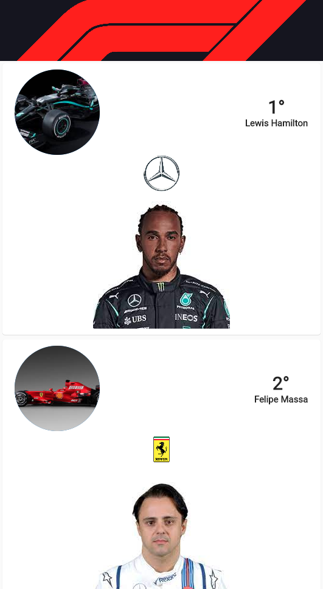
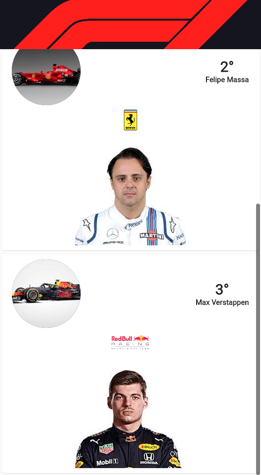

# F1 Clean Architecture

Um projeto utilizando "clean architecture" com tema F1.

## Clean Architecture

### Camada "Presenter"
Como o nome diz, presenter ou apresentação. Se responsabiliza na parte de:
- UI; 
- Controller (para gerência de estado, no projeto foi usado MobX, **mas pode ser qualquer outro, isso não deve impactar as outras camadas!**);
- Injeção de dependência (utilizado o Flutter Modular, **mas pode ser qualquer outro, isso não deve impactar as outras camadas!**).

### Camada "Domain"
Na camada de domínio, devemos nos preocupar nos comportamentos que o aplicativo irá ter. Por exemplo:
- Usecases ou casos de uso, classes que irão se responsabilizar por uma única tarefa, tendo em vista responsabilidade única, reutilização e composição;
- Entidades que definirão propriedades que serão extendidas por classes na próxima camada de datasource;
- Abstração de repositories (para comunicaçẽos externas, como localstorage ou uma requisição HTTP).

### Camada "Data"
Nessa camada, definida como fonte de dados, teremos a seguinte estrutura voltado mais para as implementações das abstrações da camada de "domain":
- Datasource, caso usamos alguma biblioteca para requisições HTTP ou localstorage, ela deve ser chamada nessa camada, isolando a aplicação das bibliotecas, pensando em cenários que troquemos biblioteca da X para Y, isso impactará apenas a camada de datasource;
- Model que extende a entidade da camada de domínio, para fazer a tradução dos dados vindo das requisições/localstorage em objetos no datasource;
- Repositories, implementação das abstrações do domínio que irá chamar o datasoruce, nos repositories iremos lidar com exceptions.

## Imagens do projeto

-

## Melhorias
Para qualquer melhoria no código ou correção de algo escrito aqui, sinta-se a vontade para mandar uma PR ou entrar em contato. 
